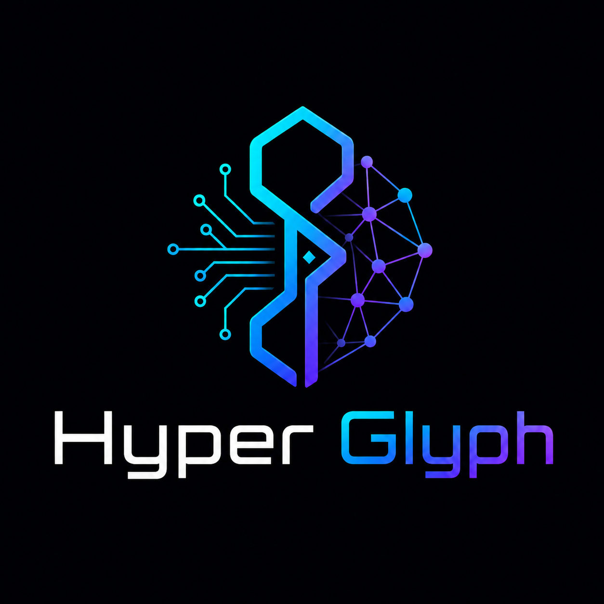

# Hyper Glyph

<p align="center">
  Hyperdimensional symbolic residual compression for neural network weights.
</p>

<p align="center">
  
</p>

<p align="center">
  <a href="https://pypi.org/project/hyperglyph-codec/"></a>
  
  
  
</p>

> **Package name:** `hyperglyph-codec`  
> **Project name:** Hyper Glyph  
> **Install:** `pip install hyperglyph-codec`  
> **Import:** `from hyperglyph import HyperGlyphCodec`

**Hyper Glyph** combines:

- **Block-level tensor compression** for NumPy arrays and neural network weights.
- **Symbolic prototype assignment** to represent repeated weight patterns compactly.
- **Sparse residual repair** to preserve reconstruction fidelity after prototype decoding.
- **Int8 residual quantization** to reduce sparse repair payload size.
- **Per-block, per-tensor, and per-channel prototype scales** for tuning reconstruction behavior.
- **Configurable compression controls** for block size, prototype count, residual size, and tensor filtering.
- **State dict compression** for model-like parameter dictionaries.
- **Optional PyTorch support** for loading, compressing, restoring, and benchmarking `.pt` state dicts.
- **`.hwz` serialization** for saving compressed models as portable archives.
- **Compression reports** with size ratio, tensor counts, and reconstruction error metrics.
- **Markdown benchmark export** with FP32, FP16 estimate, INT8 estimate, and Hyper Glyph comparisons.
- **A small CLI** for compressing, decompressing, inspecting, and benchmarking model archives.
- **Typed Python API** designed for research, experimentation, and extension.

---

## Before / After

```python
import numpy as np

from hyperglyph import HyperGlyphCodec, HyperGlyphConfig

state_dict = {
    "layer.weight": np.arange(1024, dtype=np.float32).reshape(32, 32),
}

config = HyperGlyphConfig(
    block_size=16,
    n_prototypes=32,
    residual_k=4,
)

codec = HyperGlyphCodec(config)
compressed = codec.compress_state_dict(state_dict)
restored = codec.decompress_state_dict(compressed)
report = codec.report(compressed, state_dict, restored)

print(report)
```

Example output:

```text
CompressionReport(
    original_bytes=4096,
    compressed_bytes=...,
    compression_ratio=...,
    tensors_compressed=1,
    tensors_skipped=0,
    total_mse=...,
    total_mae=...,
    max_abs_error=...
)
```

That is the core job: encode large weight tensors as reusable symbolic
prototypes plus a small residual correction, then report the size and
reconstruction tradeoff.

Hyper Glyph v0.2.0 is an experimental research codec. It is intended for
testing ideas around hyperdimensional and symbolic weight compression rather
than guaranteed production compression.

Sample v0.2.0 benchmark from `examples/artifacts/sample-v0.2-benchmark.md`:

| Representation | Bytes | Ratio vs FP32 | MSE | MAE | Max abs error |
| --- | ---: | ---: | ---: | ---: | ---: |
| FP32 | 24576 | 1.00x | 0 | 0 | 0 |
| FP16 estimate | 12288 | 2.00x | - | - | - |
| INT8 estimate | 6144 | 4.00x | - | - | - |
| Hyper Glyph | 22032 | 1.12x | 0.00266153 | 0.0405458 | 0.197096 |

The matching compressed artifact is `examples/artifacts/sample-v0.2.hwz`
and is 26,318 bytes on disk in the current zip-based archive format.

---

## Why Hyperdimensional Weight Compression?

Neural network weights often contain repeated local structure, approximate
patterns, and redundancy that can be represented more compactly than raw
floating-point tensors:

```text
Weight tensors
  -> Split into fixed-size blocks
  -> Learn reusable prototype blocks
  -> Assign each block to a prototype
  -> Store per-block scales
  -> Store sparse top-k residual corrections as int8 or float32

  -> Save compressed archive
  -> Restore approximate tensors
  -> Report compression and reconstruction metrics
```

`Hyper Glyph` is designed for experiments where you want to inspect that
tradeoff directly:

- **Large weight matrices** that can be split into repeated local blocks.
- **Prototype-based compression** where blocks share learned representatives.
- **Sparse residual repair** where only the largest reconstruction corrections are stored.
- **Scale modes** for per-block, per-tensor, or per-channel prototype scaling.
- **Approximate reconstruction** with measurable MSE, MAE, and max absolute error.
- **State dict workflows** that match common PyTorch model storage patterns.
- **Portable archive output** for saving and inspecting compressed runs.

---

## Why Not Just Quantization?

Quantization changes the numeric precision of individual weights. Hyper Glyph
uses a different representation: each tensor block is mapped to a learned
prototype, scaled, and repaired with a sparse residual.

That makes Hyper Glyph useful for experimenting with symbolic and
hyperdimensional compression ideas, not as a drop-in replacement for mature
quantization, pruning, or production model compression toolchains.

---

## Architecture

```text
Input weights
  - NumPy arrays
  - PyTorch state_dict values
    |
    v
Compression
  - tensor filtering
  - block splitting
  - prototype learning
  - prototype assignment
  - scale calculation
  - int8 or float32 sparse residual encoding
    |
    v
CompressedModel
  - compressed tensors
  - shapes
  - prototype ids
  - scales
  - residuals
  - prototype matrices
  - codec metadata
    |
    v
Decompression and report
  - reconstructed tensors
  - original/compressed byte estimates
  - compression ratio
  - MSE / MAE / max error
```

---

## Install

```bash
pip install hyperglyph-codec
```

For PyTorch state dict support:

```bash
pip install "hyperglyph-codec[torch]"
```

For documentation dependencies:

```bash
pip install "hyperglyph-codec[docs]"
```

For development:

```bash
pip install -e ".[dev,torch,docs]"
pytest
python -m build
```

---

## Quick Start

### Compress a NumPy State Dict

```python
import numpy as np

from hyperglyph import HyperGlyphCodec, HyperGlyphConfig

state_dict = {
    "weight": np.arange(256, dtype=np.float32).reshape(16, 16),
}

config = HyperGlyphConfig(
    block_size=8,
    n_prototypes=8,
    residual_k=2,
)

codec = HyperGlyphCodec(config)
compressed = codec.compress_state_dict(state_dict)
restored = codec.decompress_state_dict(compressed)

print(restored["weight"].shape)
```

### Compress a PyTorch Model

```python
import torch

from hyperglyph import HyperGlyphCodec, HyperGlyphConfig

model = torch.nn.Sequential(
    torch.nn.Linear(32, 32),
    torch.nn.ReLU(),
    torch.nn.Linear(32, 8),
)

config = HyperGlyphConfig(
    block_size=16,
    n_prototypes=16,
    residual_k=4,
    residual_dtype="int8",
    scale_mode="block",
)

codec = HyperGlyphCodec(config)
compressed = codec.compress_state_dict(model.state_dict())
restored = codec.decompress_state_dict(compressed)

print(f"Compressed tensors: {len(compressed.tensors)}")
print(f"Restored keys: {sorted(restored)}")
```

### Save and Load `.hwz` Archives

```python
from hyperglyph import load_compressed, save_compressed

save_compressed(compressed, "model.hwz")
loaded = load_compressed("model.hwz")
restored = codec.decompress_state_dict(loaded)
```

### Generate a Report

```python
report = codec.report(
    compressed_model=compressed,
    original_state_dict=state_dict,
    restored_state_dict=restored,
)

print(report.compression_ratio)
print(report.total_mse)
print(report.max_abs_error)
```

---

## CLI

Compress a PyTorch state dict into a `.hwz` archive:

```bash
hyperglyph compress model.pt model.hwz
```

Tune compression settings:

```bash
hyperglyph compress model.pt model.hwz \
  --block-size 16 \
  --hdc-dim 4096 \
  --n-buckets 16 \
  --n-prototypes 128 \
  --residual-k 8 \
  --residual-dtype int8 \
  --scale-mode channel \
  --min-tensor-size 256
```

Restore a compressed archive back to a PyTorch state dict:

```bash
hyperglyph decompress model.hwz restored.pt
```

Inspect archive metadata:

```bash
hyperglyph inspect model.hwz
```

Benchmark compression and reconstruction:

```bash
hyperglyph benchmark model.pt
```

Export the benchmark as markdown:

```bash
hyperglyph benchmark model.pt --markdown-output benchmark.md
```

---

## Benchmark Example

A small practical benchmark is enough to see the current codec behavior:

```bash
hyperglyph benchmark model.pt
```

Example markdown output:

```text
| Representation | Bytes | Ratio vs FP32 | MSE | MAE | Max abs error |
| FP32 | 24576 | 1.00x | 0 | 0 | 0 |
| FP16 estimate | 12288 | 2.00x | - | - | - |
| INT8 estimate | 6144 | 4.00x | - | - | - |
| Hyper Glyph | 22032 | 1.12x | 0.00266153 | 0.0405458 | 0.197096 |
```

The current package focuses on transparent compression experiments rather than
claiming universal size reductions. Compare the restored model against your own
accuracy, latency, and reconstruction thresholds.

---

## Main Features

### 1. **Configurable Codec**

Tune the compression shape with one dataclass:

```python
from hyperglyph import HyperGlyphConfig

config = HyperGlyphConfig(
    hdc_dim=4096,
    block_size=16,
    n_buckets=16,
    n_prototypes=128,
    residual_k=8,
    residual_dtype="int8",
    scale_mode="channel",
    seed=42,
    min_tensor_size=256,
    compress_bias=False,
)
```

### 2. **Array Compression**

Compress and reconstruct a single NumPy array:

```python
import numpy as np

from hyperglyph import HyperGlyphCodec

codec = HyperGlyphCodec()
array = np.random.randn(64, 64).astype("float32")

compressed = codec.compress_array("layer.weight", array)
restored = codec.decompress_array(compressed)
```

### 3. **State Dict Compression**

Compress dictionary-style model weights:

```python
compressed = codec.compress_state_dict(state_dict)
restored = codec.decompress_state_dict(compressed)
```

By default, small tensors and bias tensors are skipped. Set `min_tensor_size`
and `compress_bias` in `HyperGlyphConfig` to change that behavior.

### 4. **Sparse Residual Repair**

Each block is reconstructed from a prototype and scale, then corrected with a
top-k sparse residual:

```text
block ~= prototype[prototype_id] * scale + sparse_residual
```

Increase `residual_k` for better reconstruction fidelity, or reduce it for a
smaller compressed representation.

Set `residual_dtype="int8"` to quantize sparse residual values. Use
`residual_dtype="float32"` when you want unquantized residual repairs.

### 5. **Serialization**

Save compressed models as `.hwz` zip archives:

```python
from hyperglyph import load_compressed, save_compressed

save_compressed(compressed, "model.hwz")
loaded = load_compressed("model.hwz")
```

### 6. **PyTorch Adapter**

Install the `torch` extra to convert PyTorch tensors into compressed Hyper Glyph
models:

```python
from hyperglyph import compress_state_dict, decompress_state_dict

compressed = compress_state_dict(model.state_dict())
restored = decompress_state_dict(compressed, reference_state_dict=model.state_dict())
```

### 7. **Compression Metrics**

Measure the compression and reconstruction tradeoff:

```python
report = codec.report(compressed, state_dict, restored)

print(report.original_bytes)
print(report.compressed_bytes)
print(report.compression_ratio)
print(report.total_mse)
print(report.total_mae)
print(report.max_abs_error)
```

---

## Configuration

```python
from hyperglyph import HyperGlyphConfig

config = HyperGlyphConfig(
    hdc_dim=4096,
    block_size=16,
    n_buckets=16,
    n_prototypes=128,
    residual_k=8,
    residual_dtype="int8",
    scale_mode="block",
    seed=42,
    min_tensor_size=256,
    compress_bias=False,
    dtype="float32",
    device="cpu",
)
```

Key settings:

- **`block_size`** controls how many flattened weights are grouped together.
- **`n_prototypes`** controls how many reusable block representatives are learned.
- **`residual_k`** controls how many residual correction values are stored per block.
- **`residual_dtype`** controls whether sparse residual values are stored as `int8` or `float32`.
- **`scale_mode`** controls whether prototype scales are calculated per `block`, per `tensor`, or per `channel`.
- **`min_tensor_size`** skips tensors too small to benefit from compression.
- **`compress_bias`** enables compression for bias tensors, which are skipped by default.
- **`seed`** makes prototype selection deterministic.

---

## Examples

```python
import numpy as np

from hyperglyph import HyperGlyphCodec, HyperGlyphConfig

state_dict = {
    "encoder.weight": np.random.randn(128, 128).astype("float32"),
    "decoder.weight": np.random.randn(128, 64).astype("float32"),
}

codec = HyperGlyphCodec(
    HyperGlyphConfig(
        block_size=16,
        n_prototypes=64,
        residual_k=8,
        residual_dtype="int8",
        scale_mode="channel",
    )
)

compressed = codec.compress_state_dict(state_dict)
restored = codec.decompress_state_dict(compressed)
report = codec.report(compressed, state_dict, restored)

print(report)
```

```bash
hyperglyph compress model.pt model.hwz
hyperglyph inspect model.hwz
hyperglyph benchmark model.pt
```

---

## Project Structure

```text
src/hyperglyph/
  __init__.py             # Public API
  blocks.py               # Tensor flattening, block splitting, shape restore
  cli.py                  # Command-line interface
  codec.py                # HyperGlyphCodec and compressed dataclasses
  config.py               # HyperGlyphConfig
  exceptions.py           # Package exceptions
  hdc.py                  # Hyperdimensional vector helpers
  metrics.py              # Size and reconstruction metrics
  prototypes.py           # Prototype learning and assignment
  residual.py             # Sparse residual encoding and repair
  serialization.py        # .hwz save/load helpers
  torch_adapter.py        # Optional PyTorch integration
  py.typed                # Typing marker
tests/
  test_*.py               # Unit tests
docs/
  algorithm.md            # Algorithm overview
  api.md                  # API notes
  cli.md                  # CLI examples
  index.md                # Documentation home
  roadmap.md              # Planned work
examples/
  compress_mlp.py         # PyTorch MLP compression example
  compress_state_dict.py  # NumPy state dict compression example
  mnist_demo.py           # MNIST-oriented demo
  artifacts/
    sample-v0.2.hwz       # Example compressed archive
    sample-v0.2-benchmark.md # Markdown benchmark report
hyperglyph.png            # Project logo
pyproject.toml            # Package metadata and dependencies
CHANGELOG.md              # Release history
CONTRIBUTING.md           # Contribution guide
LICENSE                   # MIT license
```

---

## Development

```bash
# Install with dev, PyTorch, and docs extras
pip install -e ".[dev,torch,docs]"

# Run tests
pytest

# Run linting
ruff check .

# Type-check package code
mypy

# Build package
python -m build
```

---

## License

MIT

---

## Contributing

Contributions are welcome. Open an issue or pull request with the model shape,
codec configuration, expected compression behavior, reconstruction metrics, and
any accuracy checks you used.

---

## Citation

If you use Hyper Glyph in research, please cite:

```bibtex
@software{HyperGlyph2026,
  title={Hyper Glyph: Hyperdimensional Symbolic Residual Compression for Neural Network Weights},
  author={Robert McMenemy},
  year={2026},
  version={0.2.0},
}
```
